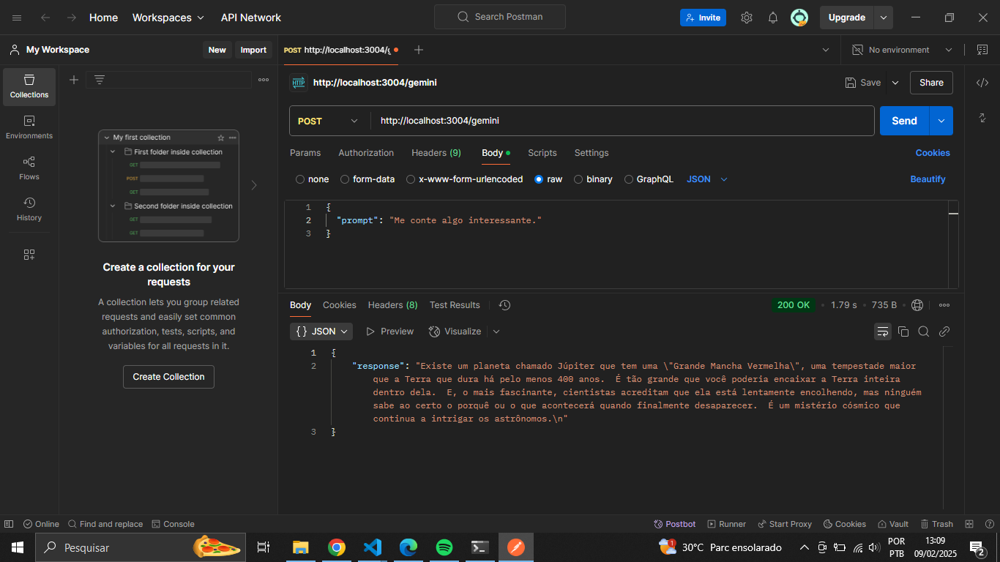

# Integração com a Gemini

Este é um pequeno projeto que utiliza a API da Gemini para processar requisições e retornar respostas com base em prompts enviados pelo usuário.

## Pré-visualização
Confira uma prévia da aplicação:



## Tecnologias Utilizadas
- Node.js
- Express.js
- CORS
- Gemini API

## Como Executar o Projeto

### 1. Clonar o Repositório
```sh
git clone https://github.com/fel1pee3/ApiGemini.git
cd ApiGemini
```

### 2. Instalar Dependências
```sh
npm install
```

### 3. Configurar a API Key da OpenAI
Edite o arquivo `index.js` e substitua `apiKey` pela sua chave da OpenAI.

### 4. Executar o Servidor
```sh
node index.js
```
O servidor rodará na porta `3000`.

## Como Testar a API
Você pode utilizar o Postman ou cURL para testar a API:

**Endpoint:** `POST http://localhost:3000/openai`

**Corpo da Requisição (JSON):**
```json
{
  "prompt": "Escreva um texto sobre tecnologia."
}
```

A resposta conterá o texto gerado pela API da Gemini.

## Licença
Este projeto está sob a licença MIT.

